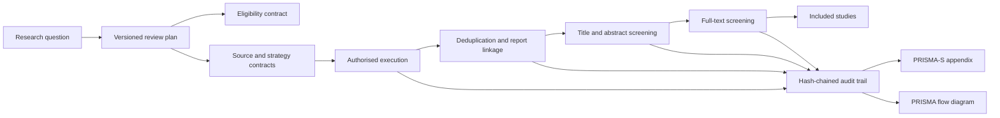

# Searchright

<!-- mcp-name: io.github.edithatogo/searchright -->

**Searchright** is a contract-first Rust workspace for planning, executing,
auditing and reporting systematic, scoping and living literature searches. It
provides one programmable core through a Rust API, CLI, Model Context Protocol
(MCP) server and agent skill.

> Status: **substantial alpha source scaffold, statically validated but not
> compiler-verified**. The contracts and deterministic MVP modules are present. A
> Rust toolchain and dependency network were unavailable in the generation
> environment, so compilation, lockfile generation and live provider execution
> remain release blockers rather than implied successes.

## Product boundary

Searchright introduces a shared crate, `evidence-search-core`, for query syntax,
provider execution, rate-limit/retry policy, evidence receipts and audit chains.
It is intended to replace equivalent custom provider-runtime code in Sourceright.

- **Sourceright** continues to own citation extraction, CSL canonicalisation,
  reference verification and citation-manager integrity workflows.
- **Searchright** owns review questions, eligibility criteria, source selection,
  search strategies, execution, deduplication, screening and PRISMA reporting.
- Both use the same provider/runtime/receipt contracts rather than drifting copies.
- Replay and response-cache parity are explicit migration work, not current shared-core
  capabilities.

## Implemented scaffold

- Versioned review-plan, query-AST, search-run, record, screening and PRISMA
  contracts.
- Database-dialect compilation with explicit warnings for lossy translation.
- Hash-chained audit events and fixture-backed provider execution.
- Deterministic DOI/PMID/title deduplication and reviewable duplicate clusters.
- Human-governed title/abstract and full-text screening state.
- PRISMA 2020 flow arithmetic and Mermaid generation; PRISMA-S item ledger.
- CLI commands for validation, compilation, deduplication, flow generation and
  audit verification.
- MCP tools with typed input schemas and deterministic JSON-text outputs over the same core; native structured-output conformance is an explicit hardening track.
- Agent skill for planning, PRESS review, execution, screening and reporting.
- Conductor 0.3.0-compatible context, MoSCoW requirements, design and 24 ordered
  tracks from foundation to mature product.
- Registry manifests and approval-gated submission packets for the official MCP
  Registry, Glama, Smithery, GitHub, crates.io and JOSS.

## Workspace

```text
contracts/                       Canonical schemas, WIT and MCP tool catalogue
crates/evidence-search-core/     Shared query/provider/audit kernel
crates/searchright-contracts/    Rust contract types
crates/searchright-connectors/   Provider adapters and fixtures
crates/searchright-dedup/        Deterministic duplicate clustering
crates/searchright-screening/    Human/agent screening state and reconciliation
crates/searchright-prisma/       PRISMA-S ledger and flow outputs
crates/searchright-store/        Append-only local review store
crates/searchright-cli/          `searchright` binary
crates/searchright-mcp/          `searchright-mcp` stdio server
crates/searchright-agent/        Agent workflow policy and plans
crates/searchright/              Public facade
skills/systematic-search/        Cross-agent skill package
conductor/                       Product context, requirements, design and tracks
```

## Intended quick start

```bash
./scripts/bootstrap.sh
cargo run -p searchright-cli -- validate-plan contracts/examples/review-plan.yaml
cargo run -p searchright-cli -- compile contracts/examples/search-strategy.yaml --dialect pubmed
cargo run -p searchright-cli -- prisma contracts/examples/prisma-flow.json --format mermaid
cargo run -p searchright-mcp
```

## Contract-first lifecycle



## Safety and methodological claims

Searchright supports reproducibility and governance; it does not certify that a
search is comprehensive, that a screening decision is correct, or that a review
meets a journal's requirements. Agent recommendations are evidence-bearing and
review-policy constrained. Licensed database access remains the user's
responsibility.

## Development status

See `PROJECT_STATUS.md`, `conductor/tracks.md` and
`verification/receipts/generation-environment.json` for completed, scaffolded and
blocked work. The first implementation target is the deterministic MVP and
Sourceright shared-core extraction, not autonomous exclusion or hosted SaaS.

## Licence

Dual licensed under MIT or Apache-2.0 at your option.
