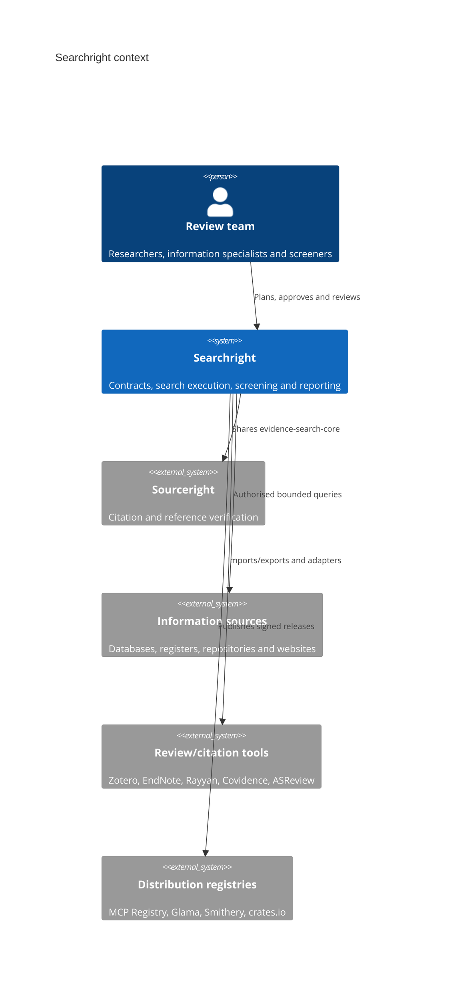
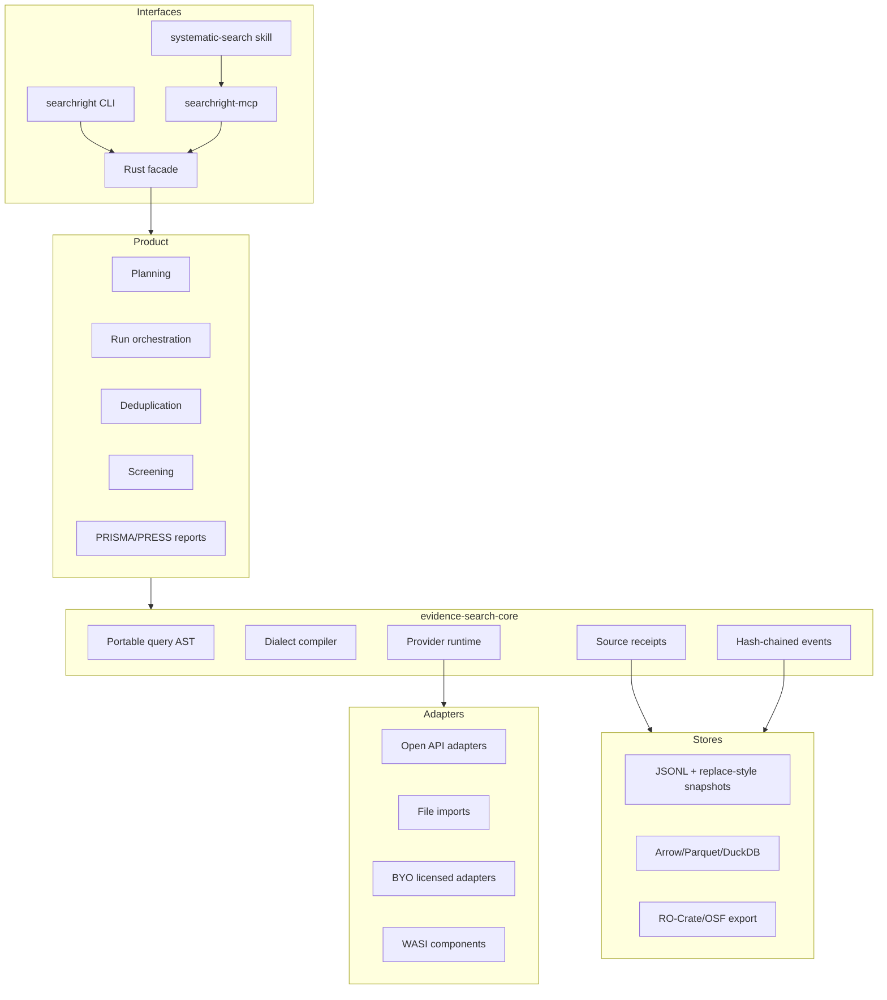
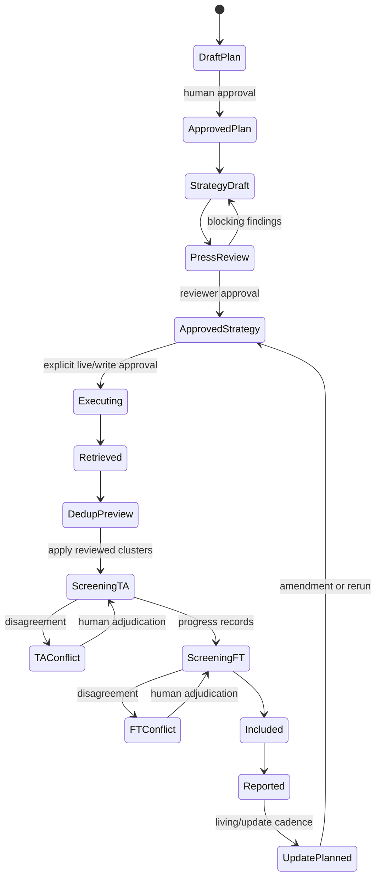
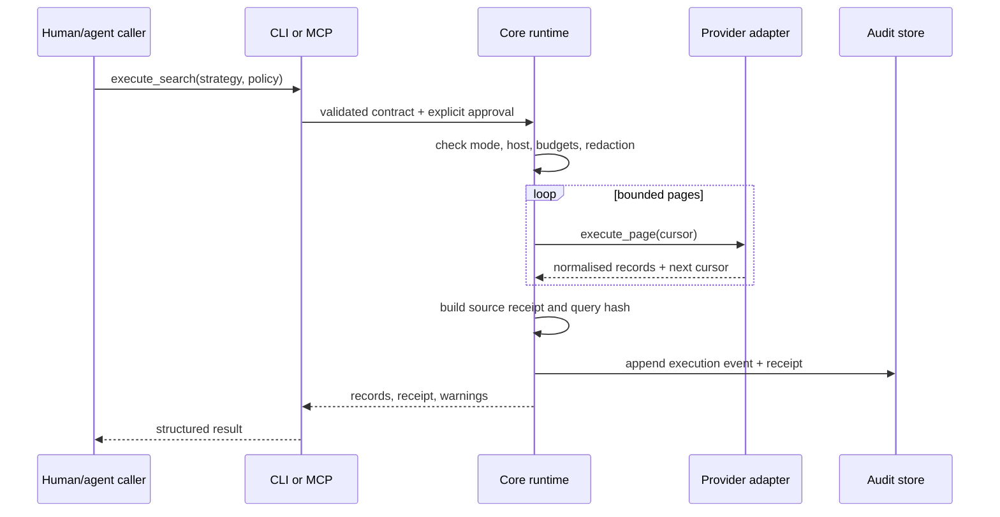

# Design

## Context and product boundary

```mermaid
C4Context
  title Searchright context
  Person(reviewer, "Review team", "Researchers, information specialists and screeners")
  System(searchright, "Searchright", "Contracts, search execution, screening and reporting")
  System_Ext(sourceright, "Sourceright", "Citation and reference verification")
  System_Ext(databases, "Information sources", "Databases, registers, repositories and websites")
  System_Ext(reviewtools, "Review/citation tools", "Zotero, EndNote, Rayyan, Covidence, ASReview")
  System_Ext(registries, "Distribution registries", "MCP Registry, Glama, Smithery, crates.io")
  Rel(reviewer, searchright, "Plans, approves and reviews")
  Rel(searchright, databases, "Authorised bounded queries")
  Rel(searchright, reviewtools, "Imports/exports and adapters")
  Rel(searchright, sourceright, "Shares evidence-search-core")
  Rel(searchright, registries, "Publishes signed releases")
```

## Container design

```mermaid
flowchart TB
  subgraph Interfaces
    CLI[searchright CLI]
    MCP[searchright-mcp]
    API[Rust facade]
    SKILL[systematic-search skill]
  end
  subgraph Product
    PLAN[Planning]
    RUN[Run orchestration]
    DEDUP[Deduplication]
    SCREEN[Screening]
    REPORT[PRISMA/PRESS reports]
  end
  subgraph Kernel[evidence-search-core]
    AST[Portable query AST]
    COMP[Dialect compiler]
    PROVIDER[Provider runtime]
    RECEIPT[Source receipts]
    AUDIT[Hash-chained events]
  end
  subgraph Adapters
    OPEN[Open API adapters]
    IMPORT[File imports]
    LICENSED[BYO licensed adapters]
    WASI[WASI components]
  end
  subgraph Stores
    JSONL[JSONL + replace-style snapshots]
    ANALYTIC[Arrow/Parquet/DuckDB]
    ROCRATE[RO-Crate/OSF export]
  end

  SKILL --> MCP
  CLI --> API
  MCP --> API
  API --> Product
  Product --> Kernel
  PROVIDER --> Adapters
  RECEIPT --> Stores
  AUDIT --> Stores
```

## Review state machine

```mermaid
stateDiagram-v2
  [*] --> DraftPlan
  DraftPlan --> ApprovedPlan: human approval
  ApprovedPlan --> StrategyDraft
  StrategyDraft --> PressReview
  PressReview --> StrategyDraft: blocking findings
  PressReview --> ApprovedStrategy: reviewer approval
  ApprovedStrategy --> Executing: explicit live/write approval
  Executing --> Retrieved
  Retrieved --> DedupPreview
  DedupPreview --> ScreeningTA: apply reviewed clusters
  ScreeningTA --> TAConflict: disagreement
  TAConflict --> ScreeningTA: human adjudication
  ScreeningTA --> ScreeningFT: progress records
  ScreeningFT --> FTConflict: disagreement
  FTConflict --> ScreeningFT: human adjudication
  ScreeningFT --> Included
  Included --> Reported
  Reported --> UpdatePlanned: living/update cadence
  UpdatePlanned --> ApprovedStrategy: amendment or rerun
```

## Provider execution sequence

```mermaid
sequenceDiagram
  participant U as Human/agent caller
  participant I as CLI or MCP
  participant C as Core runtime
  participant P as Provider adapter
  participant S as Audit store
  U->>I: execute_search(strategy, policy)
  I->>C: validated contract + explicit approval
  C->>C: check mode, host, budgets, redaction
  loop bounded pages
    C->>P: execute_page(cursor)
    P-->>C: normalised records + next cursor
  end
  C->>C: build source receipt and query hash
  C->>S: append execution event + receipt
  C-->>I: records, receipt, warnings
  I-->>U: structured result
```

## Security boundary

```mermaid
flowchart LR
  INPUT[Untrusted query/provider data] --> VALIDATE[Schema + semantic validation]
  VALIDATE --> POLICY[Capability, host and authority policy]
  POLICY --> BUDGET[Timeout, page, record and rate budgets]
  BUDGET --> ADAPTER[Sandboxed adapter]
  ADAPTER --> REDACT[Secret and payload redaction]
  REDACT --> RECEIPT[Signed/hash-linked evidence]
  RECEIPT --> HUMAN[Human review for consequential changes]
```
