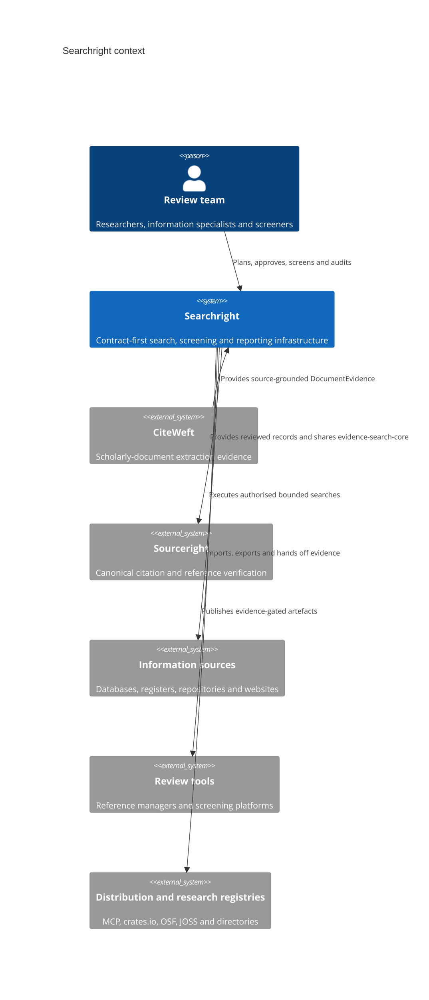
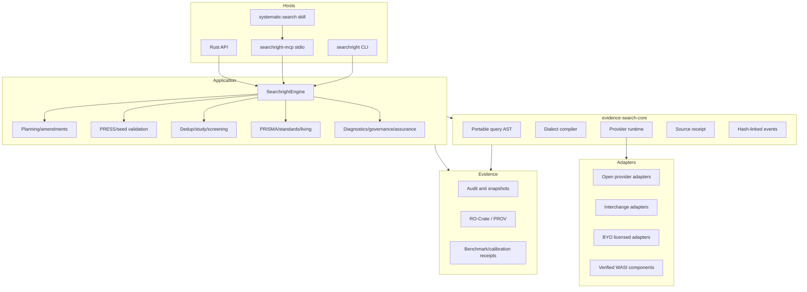
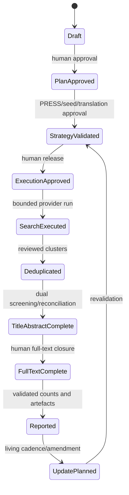
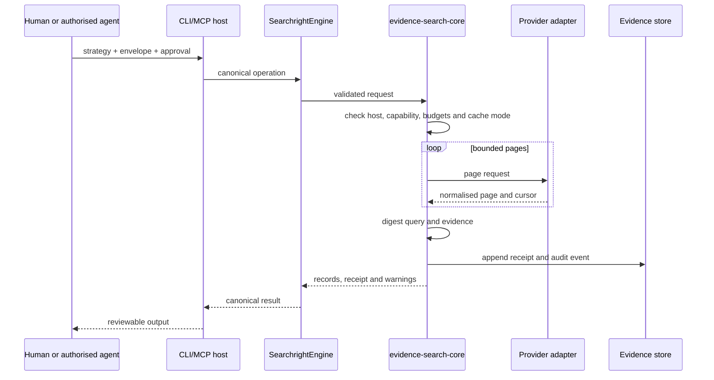
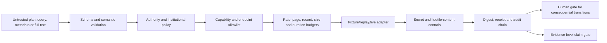
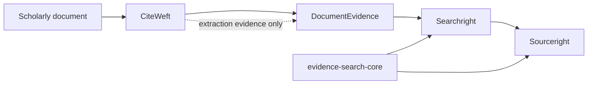
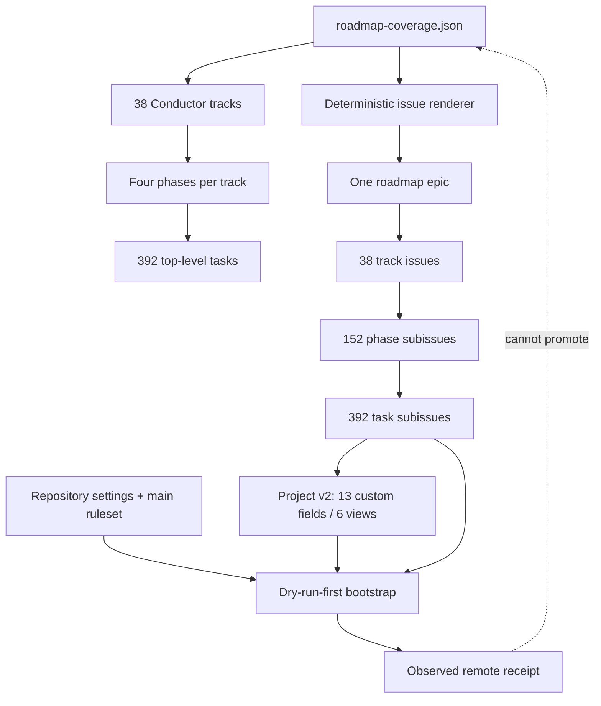
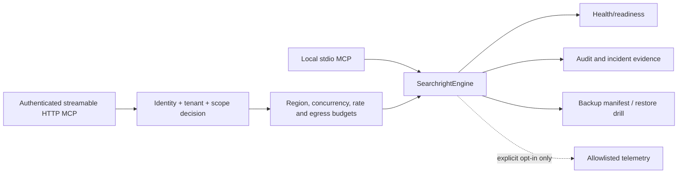
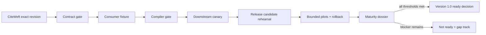

# Design

## Context

## Containers

## Lifecycle assurance

## Provider execution

## Security and evidence boundary

## Scholarly-domain integration

## Conductor and GitHub control plane

## Operational deployment boundary

## Release and maturity promotion

## Key decisions

- One application facade prevents CLI/MCP drift.
- Record, report and study are separate entities.
- Standards packs report evidence and gaps; they do not certify quality.
- Provider content is inert data, never agent instruction.
- Live and licensed access are explicit opt-ins.
- Ranking is advisory and requires calibration; no automatic final exclusion.
- Downstream migration is dual-run and reversible.
- Contract evolution and public claims are evidence-gated.
- GitHub state is a generated coordination projection, not evidence authority.
- Remote MCP authentication/tenancy and operational recovery are distinct maturity domains.
- Cross-repository promotion requires downstream canaries, RC rehearsal and rollback.
