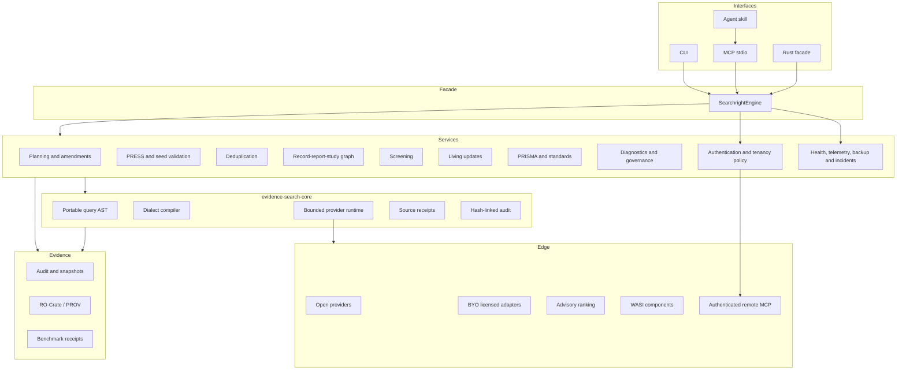
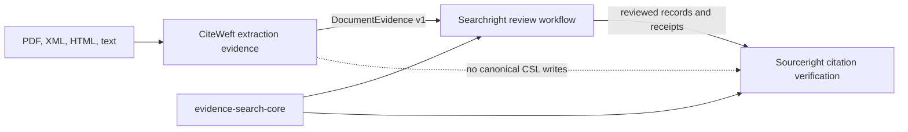
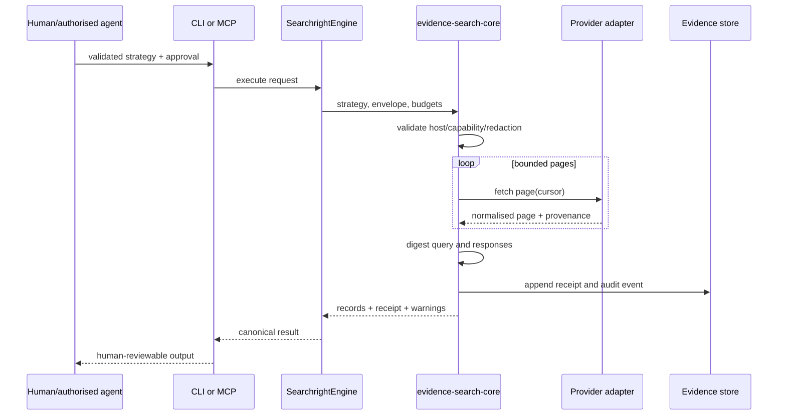
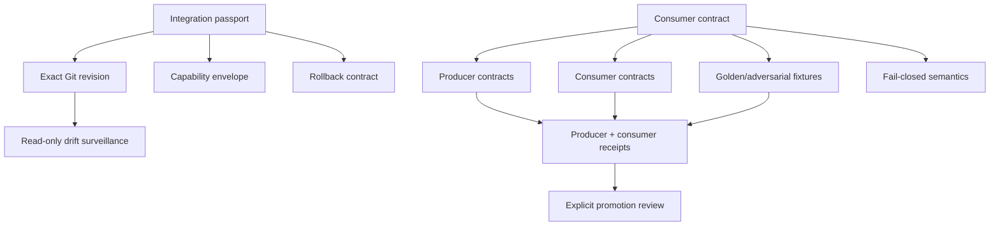

# Architecture

## Architectural thesis

Searchright separates a stable evidence kernel from product services and an
experimental edge. The boundary is designed so that new providers or agents
cannot bypass contract validation, authority, provenance or audit policy.

## Scholarly-domain boundary

CiteWeft owns extraction spans, uncertainty and diagnostics. Searchright owns
review/search state. Sourceright owns canonical citation and reference integrity.
The one-way CiteWeft adapter is a leaf package and is not re-exported by the
publishable Searchright facade.

## Three rates of change

### Stable auditable kernel

The kernel contains canonical types and deterministic mechanisms:

- query AST and compiler contracts;
- provider capabilities, execution envelopes and budgets;
- page cache/replay abstractions;
- source receipts and redaction boundaries;
- hash-linked audit events;
- stable identifiers and schema versions.

Kernel changes require contract-version and migration analysis.

### Product services

Services encode review semantics without depending on a transport:

- planning, registration and protocol amendments;
- standards packs and assessments;
- PRESS, seed recall and translation approval;
- interchange, deduplication and study linkage;
- screening and reconciliation;
- PRISMA/PRISMA-S outputs;
- living updates and provenance exports;
- diagnostics, governance and assurance.

All interfaces call these services through `SearchrightEngine`.

### Experimental edge

Live providers, licensed adapters, ranking, agents, WASI components and
authenticated remote transports may change rapidly. They remain constrained by:

- explicit capabilities;
- host allowlists and HTTPS;
- page, record, duration and rate budgets;
- no credential material in receipts;
- hostile-content handling;
- fixture/replay before live execution;
- human authority for consequential transitions.

## Data model

Searchright distinguishes:

1. **record** — a database/export representation;
2. **report** — a publication, registry entry, abstract or other report;
3. **study** — the underlying investigation described by one or more reports.

Deduplication clusters records. It does not collapse reports or infer studies
without evidence-bearing linkage.

## Application-facade rule

The CLI and MCP server are translation layers. They parse input, call
`SearchrightEngine`, and serialise the same result or diagnostic. The
`contracts/interface-catalog.json` catalogue and parity checker prevent one host
from silently gaining a different methodological behaviour.

## Storage and lineage

- Audit streams are append-only JSONL with a previous-hash chain.
- Derived snapshots use a single-writer lock, temporary file, flush/sync and
  same-filesystem replacement.
- Living update runs point to immutable parent runs; amendments are first-class
  evidence rather than overwritten protocol text.
- RO-Crate and PROV exports are generated from canonical plans, receipts and
  events rather than reconstructed prose.

## Provider sequence

## Authority model

Agents can draft, translate, critique, rank and recommend. The finite-state
assurance model requires human approval for plan approval, strategy approval,
execution release, full-text closure, reporting and living-review amendment
transitions. Agent-only final exclusion and silent external writes are denied.

## Threat model summary

Primary threats are credential leakage, provider abuse, prompt injection in
retrieved content, malformed/oversized responses, non-reproducible writes,
supply-chain compromise, provenance loss and overclaiming. Controls include:

- untrusted content treated as data;
- capability and endpoint policy;
- bounded requests and response validation;
- secret-free receipts and logs;
- component digest verification;
- pinned CI actions, SBOM and provenance generation;
- evidence-level gates for public claims.

## Deployment profiles

- **Local deterministic:** fixtures, replay and imports; default development
  profile.
- **Local live:** explicit opt-in open-provider calls with rate/cache policy.
- **Institutional:** policy-approved region, retention, full-text and telemetry
  decisions.
- **Remote single-tenant:** authenticated streamable HTTP MCP with principal,
  tenant, region, scope, replay, rate, concurrency and audit policy. The source
  contracts exist; no deployed endpoint is claimed.
- **Institutional remote:** requires explicit data-residency, backup/restore,
  incident, telemetry and operational-evidence gates in addition to transport
  conformance.

## GitHub delivery control plane

Conductor remains canonical planning state. The deterministic renderer projects
one roadmap epic, 38 track issues, 152 phase subissues and 373 task subissues.
A Project v2 manifest owns 12 custom fields and five views. Repository settings,
security controls, environments and the main ruleset are separately declared.
The bootstrap and synchronisers are dry-run-first, require explicit environment
opt-ins and a clean Git tree, are additive/idempotent, never auto-delete or
archive, and emit observed receipts. Remote issue or Project status cannot
promote an evidence level.

## Operational architecture

The operational layer is contract-first rather than an implicit property of a
server process:

- component health distinguishes liveness, readiness and degraded state;
- telemetry is disabled by default and uses an allowlist, prohibited attributes,
  sampling and retention bounds;
- backup manifests bind scope, content class, digest, parent, encryption and key
  reference;
- restore drills, recovery objectives and incident exercises are required before
  recoverability or reliability claims;
- authenticated remote MCP decisions bind principal, tenant, region, scopes,
  human approval and consequential effects;
- cross-tenant aggregation and agent-only final exclusion remain denied.

## Cross-repository release and maturity

CiteWeft, Searchright and Sourceright are promoted in order through contract,
consumer-fixture, compiler, downstream-canary, release-candidate and explicit
promotion stages. Prior pins and schema versions are retained for rollback. A
prepared release rehearsal and pilot protocol cannot be promoted to success
without execution receipts. Version 1.0 is a final evidence decision over the
maturity dossier, not a source-code milestone.

## Federated repository integration

Each active integration has an exact-revision passport and one declared
producer–consumer interaction. Local paths must exist; external contract paths
carry the observed revision. Default network, telemetry, external writes and
automatic promotion are denied. A scheduled read-only drift job can identify a
new upstream head but cannot update the pin, open a pull request or promote a
claim.

This is intentionally a federated repository model, not a submodule or copied
source model. Shared behaviour is packaged; host-specific integration remains at
the leaves.

## Compatibility and evolution

Contracts use stable schema identifiers. Additive optional changes may stay
within a version; semantic or required-field changes require a new version,
migration fixture and compatibility window. Sourceright migration uses dual-run
parity and rollback rather than a flag-day rewrite.
