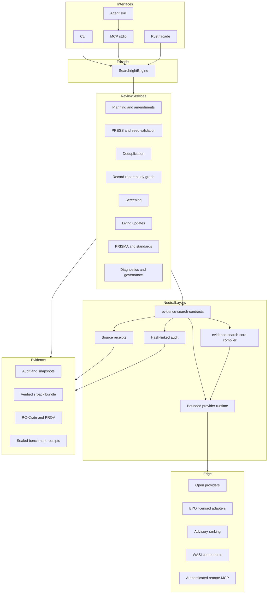
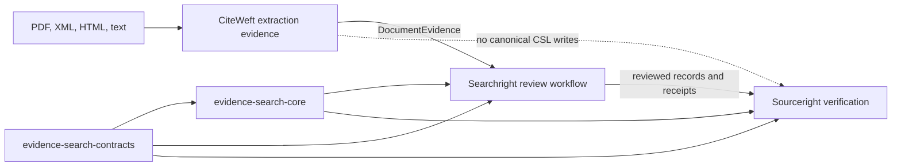
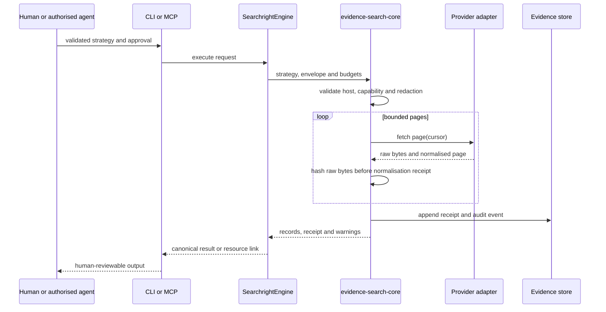
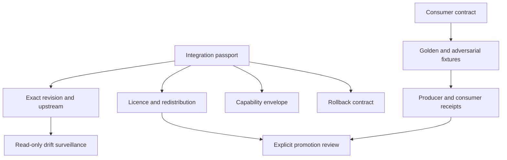

# Architecture

## Architectural thesis

Searchright separates neutral evidence contracts, a stable auditable runtime,
review-methodology services and a capability-gated experimental edge. No
provider, transport, agent or companion repository may bypass contract
validation, authority, provenance or evidence policy.



## Scholarly-domain boundary



CiteWeft owns extraction spans, layout, uncertainty and diagnostics. Searchright
owns review/search state. Sourceright owns canonical citation and reference
integrity. The one-way CiteWeft adapter remains a leaf package.

All workspace crates are currently non-publishable. The neutral contracts,
shared core and plugin SDK are only public-package candidates and require
compiler, SemVer, public-API, cargo-vet, licence and downstream-consumer evidence
before promotion.

## Layering and dependency rule

The dependency direction is:

```text
evidence-search-contracts
          ↓
evidence-search-core
     ↙           ↘
Searchright     Sourceright

CiteWeft → neutral DocumentEvidence adapter → Searchright
```

Neutral contracts cannot depend on review planning, screening or PRISMA types.
The core cannot depend on Searchright-specific workflow state. Interfaces cannot
implement independent methodology; they delegate to `SearchrightEngine`.

## Rates of change

### Neutral stable surface

- portable and native query contracts;
- provider request/page/capability contracts;
- records, receipts and audit events;
- stable schema identifiers and error taxonomy;
- compatibility baseline for JSON Schema, WIT, OpenAPI and MCP metadata.

### Auditable runtime

- source-aware compilation with translation-loss diagnostics;
- bounded provider execution, retry, rate, pagination and cancellation policy;
- cache/replay fingerprints;
- hash-linked audit verification;
- deterministic canonicalisation.

### Review-methodology services

- planning, registration and protocol amendments;
- PRESS and known-item validation;
- import/export, deduplication and report/study linkage;
- human-governed screening and reconciliation;
- PRISMA/PRISMA-S reporting;
- living updates, provenance, diagnostics and institutional policy.

### Experimental and operational edge

Live providers, licensed adapters, ranking, agents, WASI components and remote
transports may change rapidly. They remain constrained by explicit capabilities,
HTTPS host allowlists, time/page/record/response budgets, no secret material in
receipts, hostile-content treatment, fixture/replay-before-live policy and human
authority for consequential transitions.

## Query representation

A systematic strategy has two simultaneous representations:

1. **native source text**, preserved byte-for-byte with line identities and
   source spans; and
2. **normalised semantic form**, populated only for syntax that the
   source-specific parser understands.

Compilation emits a target strategy plus structured fidelity and loss findings.
Unsupported syntax remains visible as unsupported; it is never silently declared
equivalent. The checked-in seven-dialect corpus is a lexical/source-preservation
corpus, not an independently reviewed equivalence benchmark.

## Provider sequence



Rights-clear response baselines exist for PubMed ESearch and ESummary, Europe
PMC, Crossref and OpenAlex. They pin exact fixture hashes, expected JSON pointers,
HTTPS origins and hosts. Separate provider-policy manifests record query and
response classification, credential handling, raw-response retention and the
absence or presence of terms/legal review. Technical compatibility cannot
promote policy approval, and policy metadata cannot prove live compatibility.
The baselines detect local or expected-shape drift only; Rust parser equivalence
and current upstream compatibility require compiled fixture and redacted live
canary receipts.

## Data model

Searchright distinguishes:

1. **record** — a database/export representation;
2. **report** — a publication, registry entry, abstract or other report;
3. **study** — the underlying investigation described by one or more reports.

Deduplication clusters records. It does not collapse reports or infer a study
without evidence-bearing linkage.

## Storage, events and derived state

- Audit streams are append-only JSONL with a previous-hash chain.
- The Rust audit verifier recomputes canonical BLAKE3 event hashes.
- The filesystem store is single-writer, flushes and syncs data, and replaces
  snapshots on the same filesystem. This is not a claim of cross-platform or
  multi-process transactional durability.
- The stdlib review-state reducer accepts only a stream bound to a caller-supplied
  verified audit head. It checks linkage, review identity and event identity,
  treats snapshots as disposable derived state, and rejects non-human attempts
  to exercise final screening authority.
- Living-review runs point to immutable parents and amendments are first-class
  evidence.
- Persisted contract evolution is declared in a migration registry. Unknown,
  destructive or implicit write upgrades fail closed; representative compiled
  readers/writers and real persisted-data rehearsals remain higher evidence.
- The network-free recovery rehearsal checks atomic replacement, stale temporary
  files, backup hashes, repeated restore and tamper rejection. It is a reference
  mechanics proof, not production durability, encryption or RTO/RPO evidence.

## Portable review bundle

`searchright pack`/`verify` behaviour is represented locally by
`scripts/review_bundle.py` and the `.srpack` format. A bundle contains a manifest,
payload entries, exact SHA-256 values and a descriptor Merkle root. Packing is
deterministic and rejects path traversal, symlinks, `.git`, excessive sizes,
duplicate archive names and likely secret-bearing inputs.

A successful bundle verification proves declared byte integrity and policy
conformance. It does not prove that the search was adequate, citations are true,
screening decisions are correct or a repository accepted the deposit.

## Application-facade and MCP rule

The CLI and MCP server are translation layers. They parse inputs, call
`SearchrightEngine`, and serialise the same result or diagnostic. The
interface catalogue and parity checker prevent one host from silently gaining a
different methodological operation.

Large searches should become resumable MCP tasks and expose paginated resources
rather than returning complete corpora in one tool result. Current task/remote
MCP source remains a planned higher-evidence surface until protocol transcript,
cancellation, authentication and tenancy tests pass.

## Authority model

Agents can draft, translate, critique, rank and recommend. Only an authorised
human may approve a plan, release a consequential execution/write, make a final
eligibility decision, close full-text screening, approve an amendment or promote
a release/readiness claim. Rejected authority attempts remain auditable.

## Threat model summary

Primary threats include credential leakage, provider abuse, SSRF, prompt
injection in retrieved content, malformed/oversized responses, parser bombs,
non-reproducible writes, benchmark leakage, supply-chain compromise, licence
contamination, provenance loss and overclaiming.

Controls include untrusted-content-as-data policy, capability and host
allowlists, bounded requests and responses, secret-free receipts, sealed labels,
licence firewalls, pinned tools/actions, cargo-vet policy, SBOM/provenance
material and evidence-level claim gates.

## GitHub delivery and portfolio control planes

Conductor remains canonical planning state. The deterministic renderer projects
one roadmap epic, 38 track issues, 152 phase subissues and 377 task subissues.
The delivery Project owns 13 custom fields and six views and explicitly separates
implementation state from evidence level.

A second Evidence Infrastructure Portfolio contains only cross-repository
contracts, licence decisions, migrations and release-train blockers. Both
projections are dry-run-first, additive, idempotent and non-destructive. Remote
issue or Project status cannot promote implementation or evidence.

## Federated repository integration

Each active integration records exact revision, canonical upstream, local-fork
role, licences, redistribution, capability, failure and rollback policy. A
consumer-driven contract suite and read-only drift process separate producer and
consumer release cycles. Git submodules and copied implementation are not the
default.



## Compatibility and release train

The checked-in contract-surface baseline freezes exact JSON Schema, WIT, OpenAPI
and MCP metadata bytes for the current alpha. Any addition, removal or hash
change requires an explicit update and compatibility note. Hash equality detects
exact drift; semantic compatibility still requires migration and consumer tests.

The ecosystem lock fixes observed CiteWeft, Searchright, Sourceright, MCP SDK,
standard-pack, policy-pack and benchmark identities. CiteWeft, Searchright and
Sourceright are promoted through contract, consumer fixture, compiler,
downstream canary, release candidate and explicit human promotion stages. No
stage promotes automatically, and prior pins remain available for rollback.

The definition of a completed end-to-end capability is maintained in
`docs/vertical-slice-definition-of-done.md`. Assertion-level traceability—not
file presence, roadmap prose or issue state—is the implementation authority.
