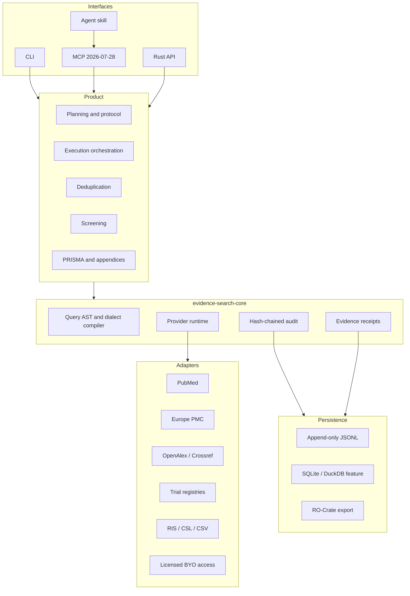

# Architecture

Searchright uses a hexagonal architecture. Domain contracts and deterministic
logic do not depend on provider SDKs, MCP transports or storage engines.

## Dependency rule

Dependencies point inward. `evidence-search-core` may depend on contracts and
portable runtime primitives. It must not depend on Searchright screening,
Sourceright CSL logic, an MCP server, a CLI or a database-specific UI.
