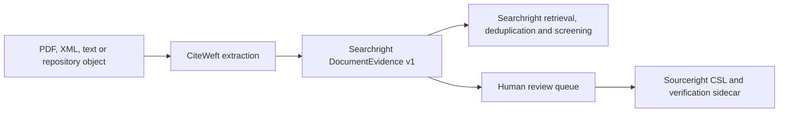

# CiteWeft integration

CiteWeft is the neutral, auditable scholarly-document extraction layer. It is
GROBID-inspired, but is not a GROBID fork, reimplementation or compatibility
claim. Searchright consumes its evidence through an optional one-way adapter.
Sourceright may then adapt reviewed reference evidence into CSL and verification
sidecars.

## Boundary rules

- CiteWeft owns layout, source spans, extraction uncertainty, diagnostics and backend routing.
- Searchright owns review plans, searches, records/reports/studies, screening, audit, PRISMA reporting and living-review lineage.
- Sourceright owns canonical CSL, provider-backed citation verification and reference-integrity reporting.
- `DocumentEvidence` is evidence only: `canonical_write_permitted` must be false.
- Whole-document text is not retained by default.
- Only `searchright-citeweft` depends on CiteWeft. The shared search kernel remains backend-neutral.

## Compatibility protocol

The adapter is pinned to CiteWeft commit `8c8932976250f9ca91c2bbda28ed68eeb191fa42`. Compatibility requires schema validation, dependency-boundary checks, compiled adapter tests, golden span/uncertainty fixtures, downstream Sourceright compatibility tests and an explicit rollback before changing the pin.

GROBID HTTP execution remains an optional backend concern. It is not activated by Searchright's default build, static harness or MCP server.
