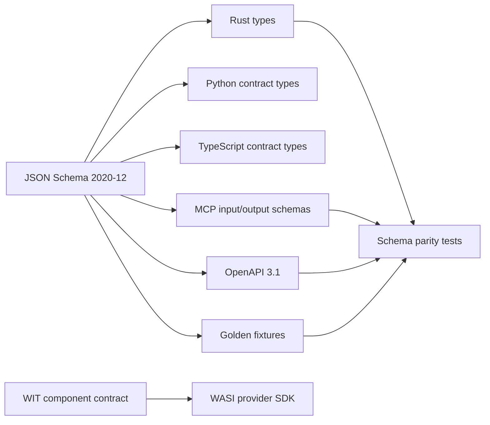

# Contract lifecycle

Each public operation has one canonical JSON Schema and generated or manually
verified representations for Rust, Python, TypeScript, CLI JSON/YAML, MCP
input/output and persisted events. Canonical JSON Schema owns validation and
contract-binding generation; compiled Rust schemas are drift diagnostics whose
complete recorded differences remain fail-closed for exact semantic parity.

The Python and TypeScript outputs are deliberately contract-only packages. They
contain no client or review-workflow logic and remain private. Package install,
client behaviour, publication and downstream adoption are Track 35 / SR-086
evidence gates. The ownership decision and loss policy are recorded in
ADR-0017.

## Versioning rules

- Contract IDs are stable URIs such as `org.searchright.review-plan.v1`.
- Additive optional fields may remain in a major schema version.
- Renames, changed semantics or stricter required fields require a new major
  contract and an explicit migration.
- Every persisted event includes schema version, event ID, review ID, actor,
  timestamp, previous hash and event hash.
- Public MCP tools return typed structured content and a text rendering.
