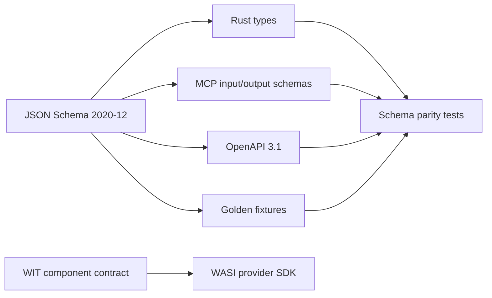

# Contract lifecycle

Each public operation has one canonical schema and generated or manually verified
representations for Rust, CLI JSON/YAML, MCP input/output and persisted events.

## Versioning rules

- Contract IDs are stable URIs such as `org.searchright.review-plan.v1`.
- Additive optional fields may remain in a major schema version.
- Renames, changed semantics or stricter required fields require a new major
  contract and an explicit migration.
- Every persisted event includes schema version, event ID, review ID, actor,
  timestamp, previous hash and event hash.
- Public MCP tools return typed structured content and a text rendering.
