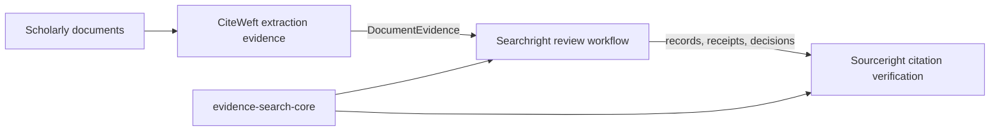

# Integration architecture

## Three-domain boundary

CiteWeft is the extraction layer, Searchright is the review/search workflow, and
Sourceright is the citation/reference verification layer. None may silently
write another domain's canonical state.

Sourceright should additionally expose provenance-bearing scholarly-integrity
signals for retractions, corrections, expressions of concern, duplicate
publications and version/update relationships. Searchright may surface these as
review-priority and human-inspection evidence, but a signal alone must never
become an automatic study-exclusion decision.

## Integration mechanisms

1. JSON Schema/WIT/OpenAPI contracts and golden fixtures.
2. Optional exact-revision Rust dependencies at leaf adapters only.
3. Stable CLI JSON/JSONL for polyglot and air-gapped consumers.
4. MCP tools/resources for agent hosts with explicit effect metadata.
5. WASI components for untrusted or independently released provider adapters.
6. Generated compatibility adapters and consumer-driven contract suites.

## Upgrade protocol

A scheduled job compares observed upstream revisions with `integration/locks.json`.
It emits a drift receipt or opens review work only after explicit approval. It
never changes the pin, dependency graph, public claim or downstream code.

Every activation requires a repository-specific issue, fixtures, parity gates,
rollback and an evidence ceiling. Candidate integrations in the passport index
are not active dependencies.
## Consumer-driven contract suite

`integration/consumer-contract-suite.json` covers every active passport exactly
once. Each interaction declares producer and consumer repositories, a neutral
contract version, revision-bearing producer contracts, local consumer
contracts, deterministic fixtures, gates on both sides and fail-closed
behaviour. `automatic_promotion` is always false.

The local checker validates declaration completeness and local fixture paths. It
does not claim the producer repository executed its gate. Compatibility is
promoted only when both sides emit receipts tied to the same revisions and
contract version.

## Packaging boundary

Internal path dependencies carry exact workspace versions so they can later be
packaged in dependency order. The CiteWeft adapter remains `publish = false`
until CiteWeft itself has a registry-backed dependency. The publishable
Searchright facade does not depend on or re-export that leaf adapter.

A separate `evidence-search-core` repository is deferred. The package can be
published from this workspace first; repository extraction becomes justified
only when multiple consumers need an independently governed lifecycle.
