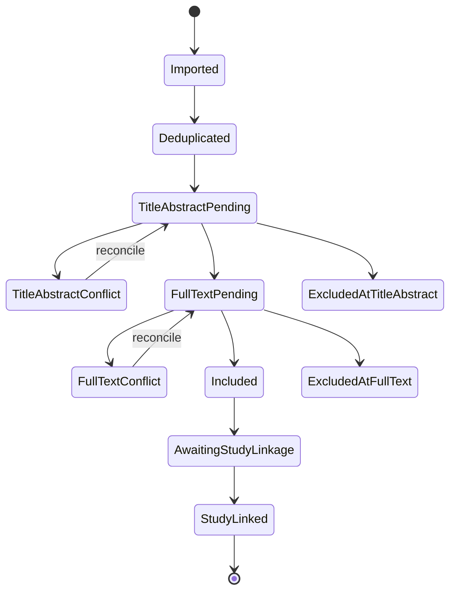

# Screening model

Searchright models **records**, **reports** and **studies** separately. Database
records may refer to the same report; multiple reports may describe one study.
Deduplication removes duplicate records, while report-to-study linkage is a
separate reviewable operation.

## Agent authority

The default is `advisory_only`: agents can rank and recommend, but not create a
final exclusion. `include_only` may allow automatic progression to human review.
Any stronger mode requires an explicit protocol policy, calibration evidence,
human confirmation and an audit event.
