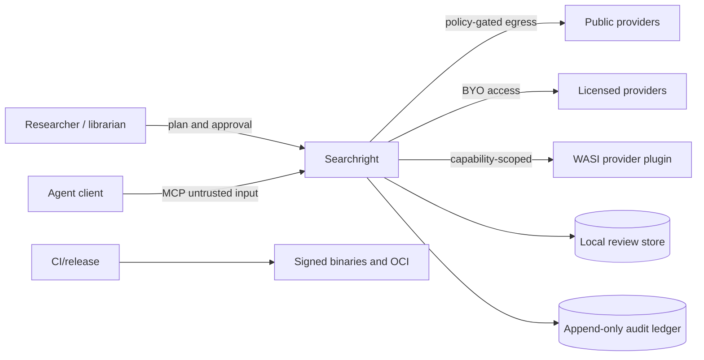

# Threat model

## Assets

Review protocols, credentials, licensed database access, search histories,
full-text locations, screening decisions, reviewer identities, audit integrity,
release artefacts and registry identity.

## Trust boundaries

## Principal threats and controls

| Threat | Control |
| --- | --- |
| Prompt/tool injection from provider text | Treat records as data; never execute retrieved instructions; separate agent prompts from content. |
| Credential leakage | Secret-typed config, redaction, no audit persistence, isolated live tests. |
| Unauthorised or excessive egress | Source allowlist, bounded pagination, rate limits, timeouts and per-run budgets. |
| Licence/terms breach | Provider policy manifest, BYO access, manual-import fallback, no anti-bot evasion. |
| Malicious plugin | Signed/pinned components, deny-by-default WASI capabilities, memory/time/output limits. |
| Audit tampering | Canonical JSON and BLAKE3 hash chain; optional external transparency receipt. |
| Agent overreach | Authority policy, dry-run, protocol amendment gate and human final-exclusion default. |
| Supply-chain compromise | Locked dependencies, cargo-deny/audit, action SHA pinning, SBOM, provenance and signatures. |
| Data exfiltration through telemetry | Telemetry off by default; local structured logs; explicit opt-in export. |
| Denial of service | Input size limits, bounded concurrency, cancellation, quotas and backpressure. |

See `contracts/security/security-invariants.json` for machine-readable invariants.
