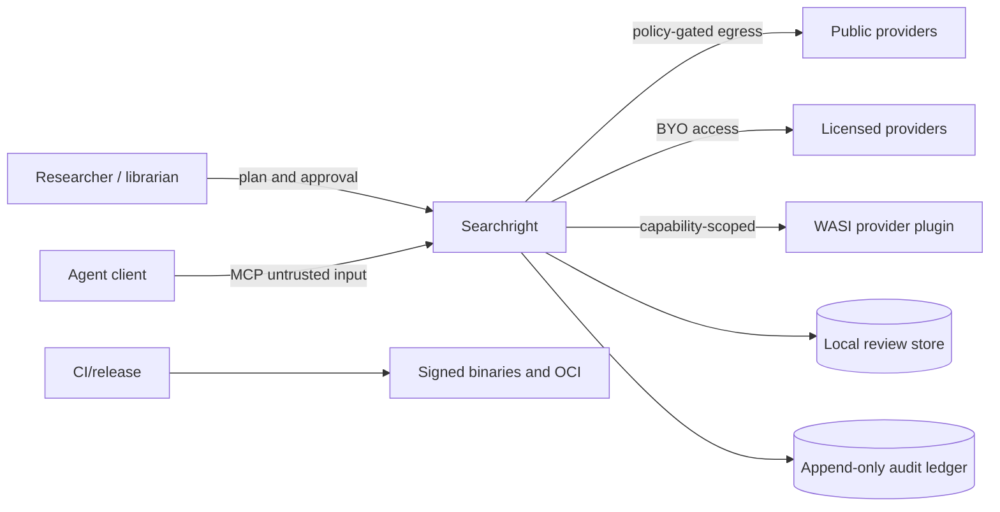

# Threat model

## Assets

Review protocols, credentials, licensed database access, search histories,
full-text locations, screening decisions, reviewer identities, audit integrity,
release artefacts and registry identity.

## Trust boundaries

## Principal threats and controls

| Threat | Control |
| --- | --- |
| Prompt/tool injection from provider text | Treat records as data; never execute retrieved instructions; separate agent prompts from content. |
| Credential leakage | Secret-typed config, redaction, no audit persistence, isolated live tests. |
| Unauthorised or excessive egress | Source allowlist, bounded pagination, rate limits, timeouts and per-run budgets. |
| Licence/terms breach | Provider policy manifest, BYO access, manual-import fallback, no anti-bot evasion. |
| Malicious plugin | Signed/pinned components, deny-by-default WASI capabilities, memory/time/output limits. |
| Audit tampering | Canonical JSON and BLAKE3 hash chain; optional external transparency receipt. |
| Agent overreach | Authority policy, dry-run, protocol amendment gate and human final-exclusion default. |
| Supply-chain compromise | Locked dependencies, cargo-deny/audit, action SHA pinning, SBOM, provenance and signatures. |
| Data exfiltration through telemetry | Telemetry off by default; local structured logs; explicit opt-in export. |
| Denial of service | Input size limits, bounded concurrency, cancellation, quotas and backpressure. |

## Remote MCP tenancy threats

These controls are access-plane claims only until the remote transport, hosting
boundary and external security review are evidenced. Track 34 remains
`source_verified` with `external_gate: true`.

| Threat class | Mitigation | Residual risk | Hosted-deployment evidence needed |
| --- | --- | --- | --- |
| Request replay | Bind the verified issuer, tenant, subject and token ID to a bounded request-ID digest in the process replay ledger. | Caller-chosen IDs, process restart and horizontally scaled replicas remain outside this fixture proof. The current remote surface is read-only. | Shared atomic replay storage, restart/expiry tests and consequential-operation idempotency evidence. |
| Token theft with a stale token | Verify signature, audience, expiry, issued-at age, exact issuer and RS256 key before constructing access context. | A fresh stolen bearer remains usable until issuer revocation or key removal. | Live IdP revocation, rotation, outage and clock-skew evidence. |
| Issuer spoofing or confused deputy | One remote process profile binds one exact issuer to one local rotating JWKS and audience. | Operator provisioning can still install the wrong keys or issuer. | Independently reviewed issuer metadata and rotation procedure with negative deployment tests. |
| Resource exhaustion by request flooding | Limit concurrent authentication, cap bodies and request duration, and apply an in-process per-principal rate window. | Anonymous floods should also be limited at the trusted edge; distributed replicas require shared limits. | Edge overload tests, shared quota evidence and bounded-cardinality observations. |
| Concurrency exhaustion starving other tenants | Use a tenant-wide in-process RAII permit released on completion, timeout or cancellation. | The permit covers HTTP work in one process, not distributed background-task scheduling. | Multi-replica scheduler, drain, fairness and cancellation evidence. |

See `contracts/security/security-invariants.json` for machine-readable invariants.
